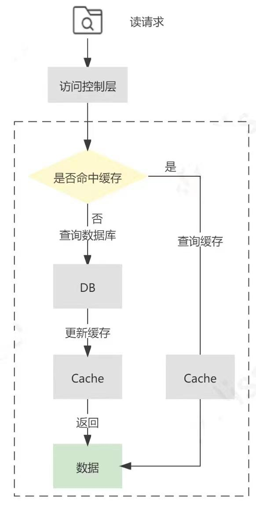
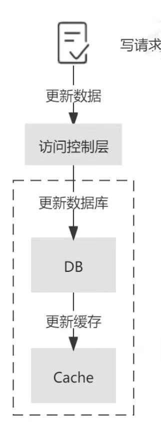

## 1. CAP 定理
Consistency（一致性）、Availability（可用性）、Partition Tolerance（分区容忍性）

### 为什么三者不可兼得? 
分布式中P是一定的
- 想保证A，就要牺牲一致性，让不同节点不一致时也可对外提供服务。
- 想保证C，就一定要牺牲可用性，等不同节点数据一致后，再对外提供服务。
### CP / AP 系统的代表。
ZooKeeper 属于 CP，Redis 属于 AP。

## 2. BASE
Basically Available（基本可用）、Soft state（软状态）、Eventually consistent（最终一致）。

是CAP 的工程折中实现，BASE 理论就是在 牺牲强一致性（C） 的前提下，通过“最终一致性”来实现系统的 高可用 (A)。

- BA: 系统在出现故障时，允许损失部分可用性（如响应变慢、部分功能降级），但整体仍可用。
    - 服务降级：例如推荐系统异常时，返回默认结果
    - 延迟响应：高并发时延迟增加；
    - 读写限流：在流量高峰时牺牲一部分用户请求。
- S: 系统中的状态可以是中间状态（非强一致），允许存在延迟同步的过程。   
    - 状态允许“暂时不一致”；
    - 节点间的副本可以异步更新；
    - 系统状态不是强制立即同步的，而是通过后台机制慢慢趋于一致。
- E: 经过一段时间后，所有节点的数据最终会达到一致状态。
    - 只要在一定时间窗口内数据能收敛到一致状态，不要求实时一致。
    - 典型实现方式：
        - 异步复制（如主从复制）
        - 事件队列（如消息中间件）
        - 补偿机制（如分布式事务补偿）
### BASE 理论的典型应用场景
| 场景    | 示例             | 特点         |
| ----- | -------------- | ---------- |
| 电商系统  | 下单、库存、支付服务解耦   | 允许库存状态异步更新 |
| 社交系统  | 点赞、评论计数        | 不要求实时准确    |
| 分布式缓存 | Redis + DB 同步  | 允许短暂数据不一致  |
| 消息系统  | Kafka、RabbitMQ | 异步保证最终一致   |


## 3. 分布式 ID 生成方案
要求全局唯一、高性能
### 场景：订单号、日志追踪、用户 ID

### 常见方案：
#### 数据库自增 ID
#### Redis 自增
- INCR
    - 单点瓶颈：如果 Redis 节点挂了，自增 ID 无法生成。
    - 不支持跨多 Redis 节点的全局唯一。
- 多 Redis 分片 + 步长（Segmented ID）
    - ID 不连续。
    - 步长设置不合理可能导致 ID 跨越过大
- Redis + 预分段 ID（Segment Pre-allocation）：Redis 每次给应用分配一段 ID，例如 批量 1000 个：
    - 应用重启或宕机可能浪费未使用的 ID。
    - 不好分，分多分少的不合适。
####  Snowflake 雪花算法
适合小流量/无需数据库：直接用 Snowflake 模式。
##### 1. 一个标准的 64 位 Snowflake ID
```
0 - 41 - 10 - 12
|   |   |   |
符号位 时间戳 机器ID 序列号
```
| 部分     | 位数 | 说明                     |
| ------ | -- | ---------------------- |
| 符号位    | 1  | 固定 0，表示正数              |
| 时间戳    | 41 | 毫秒级时间戳，相对于自定义纪元（epoch） |
| 数据中心ID | 5  | 集群中数据中心编号              |
| 机器ID   | 5  | 数据中心内部机器编号             |
| 序列号    | 12 | 毫秒内自增序列号（0~4095）       |

- 数据中心 ID + 机器 ID 用于区分不同节点，保证全局唯一。
- 序列号解决单节点高并发生成问题
- 如果集群节点很多，可以增加机器 ID 位数或采用 Redis + Snowflake 来生成序列号，保证跨数据中心也不冲突。

PS: 不同实现可以调整数据中心和机器位数，总位数保持 64 位。

##### 2. ID 特性
- 全局唯一
    - 时间戳 + 数据中心 + 机器 + 序列号，保证整个集群生成的 ID 不重复。
- 趋势递增
    - 时间戳占主导，ID 随时间递增，有利于数据库索引优化。
- 高性能
    - 完全在内存计算，无需分布式锁或数据库操作。
    - 每毫秒每节点可生成 2^12=4096 个 ID
##### 3. 工作流程
1. 获取当前毫秒时间戳 currentTime.
2. 判断是否与上次生成时间 lastTimestamp 相同：
    - currentTimestamp == lastTimestamp
        - 同一毫秒内生成 ID，需要序列号自增
    - currentTimestamp > lastTimestamp
        - 新的一毫秒，序列号重置为 0，重新开始计数
    - currentTimestamp < lastTimestamp
        - 一般发生在**系统时钟回退**
        - 一般策略：
            - 抛异常（严格要求）
            - 等待 lastTimestamp，直到时间追上去
            - 或者使用备用序列号/节点策略
3. 组合各部分（时间戳、数据中心 ID、机器 ID、序列号）生成 64 位 ID。
4. 返回 ID。

#### Segment（号段模式）
##### 核心思想：预分配 ID 段

1. 数据库只存储每个业务（biz_tag）的 最大 ID 和 步长 step。
2. 每次服务节点从数据库取 一段 ID：
    - 比如 step = 1000，则一次从数据库拿到 [max_id + 1, max_id + 1000]。
3. 服务节点把这 1000 个 ID 缓存在内存中，直接发给客户端。
4. 数据库只在每段用完时更新一次，不是每个 ID 都写数据库。

######  流程
1. 数据库准备: 
    - 表 leaf_alloc 存储每个业务（biz_tag）的 max_id 和 step
        ```mysql
        CREATE TABLE leaf_alloc (
            biz_tag VARCHAR(128) PRIMARY KEY,
            max_id BIGINT NOT NULL,
            step INT NOT NULL
        );
        ```
    - 每行记录一个业务线的全局 ID 最大值和分段步长。
2. 服务节点获取 ID 段（Segment），节点在内存中保存这一段 ID，供后续快速分配
    ```mysql
    UPDATE leaf_alloc
    SET max_id = max_id + step
    WHERE biz_tag = 'order';
    ```
3. 内存发号
    - 节点在内存中维护当前段：
        - currentSegment = [startId, endId]
        - sequence 指向当前已分配的 ID
    - 每个请求从 currentSegment 中 顺序分配 ID
    - 不访问数据库，速度非常快。
4. 异步加载下一段
    - 当当前段使用到一定阈值（如剩余 20%）：
        - 异步线程提前从数据库获取下一段 ID
        - 保证连续发号，不阻塞客户端请求
5. 客户端获取 ID
    - 客户端调用服务 API：
        - 节点从内存段中返回下一个 ID
        - 内存段耗尽时自动切换到下一段
    - 高并发下，多节点同时发号，不会冲突，因为每段在数据库中保证唯一
##### Segment使用mysql为什么适合大流量呢？
Leaf 的 Segment 模式使用 MySQL 仍然能支撑大流量，核心原因在于 ID 分段的设计减少了数据库访问频率。

## 4. 分布式事务
## 5. 分布式锁
- Redis 实现方式（SETNX + EXPIRE）
    - 会存在：主从延迟导致锁丢失
- Rdis 官方实现的：Redisson RedLock 原理
- zookeeper（临时有序节点）
- etcd

## 6. 一致性哈希

## 7. 分布式缓存
### 方案
#### 1. Cache-Aside


Cache-Aside 中可能存在更新数据库成功，但删除缓存失败的场景。需要引入*消息队列*或*binlog*
****

#### 2. Read-Through 
意为读穿透模式，它的流程和 Cache-Aside 类似，不同点在于 Read-Through 中多了一个访问控制层，读请求只和该访问控制层进行交互，而背后缓存命中与否的逻辑则由访问控制层与数据源进行交互，业务层的实现会更加简洁，并且对于缓存层及持久化层交互的封装程度更高，更易于移植


#### 3. Write-Through
Write-Through 意为直写模式，对于 Write-Through 直写模式来说，它也增加了访问控制层来提供更高程度的封装。不同于 Cache-Aside 的是，Write-Through 直写模式在写请求更新数据库之后，并不会删除缓存，而是更新缓存

Write-Through 直写模式适合写操作较多，并且对一致性要求较高的场景，在应用 Write-Through 模式时，也需要通过一定的补偿机制来解决它的问题。


#### 4. Write back（回写， 也叫延迟写入，write behind）
在处理写请求时，只更新缓存而不更新数据库.

对于数据库的更新，则是通过批量异步更新的方式进行的，批量写入的时间点可以选在数据库负载较低的时间进行。

在 Write-Behind 模式下，写请求延迟较低，减轻了数据库的压力，具有较好的吞吐性。但数据库和缓存的一致性较弱，比如当更新的数据还未被写入数据库时，直接从数据库中查询数据是落后于缓存的。同时，缓存的负载较大，如果缓存宕机会导致数据丢失，所以需要做好缓存的高可用。显然，Write behind 模式下适合大量写操作的场景，常用于电商秒杀场景中库存的扣减。

使用redis原子操作`DECR`、库存预减 + 异步落库、库存预减 + 异步落库、限流 + 白名单或秒杀资格限制，来解决秒杀场景的超卖。

#### 5. 各厂商提供的DTS服务
提供了包括数据迁移、数据订阅、数据同步等在内的多种数据传输能力，常用于不停服数据迁移、数据异地灾备、异地多活(单元化)、跨境数据同步、实时数据仓库、查询报表分流、缓存更新、异步消息通知等多种业务应用场景。

大规模的缓存数据一致性场景下，优先推荐使用 DTS 服务。
**为什么不能先删除缓存，再更新DB**

先删除缓存，再更新数据库，会出现缓存脏数据。通过延迟双删处理（`sleep` 或采用延迟队列）难以预估延迟多久。
### 经典问题：
1. 缓存穿透 / 击穿 / 雪崩
2. 缓存与数据库双写一致性
3. 延迟双删策略
4. 异步消息补偿方案

深挖题：
- 主从架构下缓存一致性如何保证？
## 8. 分布式系统的可用性保障
- 限流、熔断、降级机制。
- 雪崩保护。

## 9. 分布式系统的幂等性设计
- 重试导致重复执行怎么办。
- 幂等键设计：唯一请求 ID、去重表、状态机。
## 6. 一致性协议
- Paxos（理论）
- Raft（工程）：etcd、Zookeeper