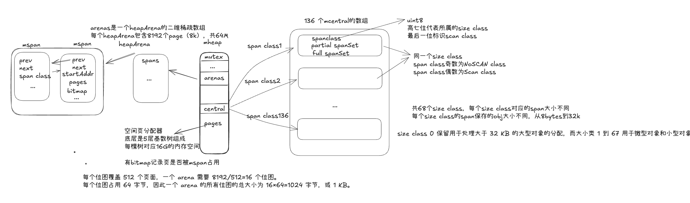
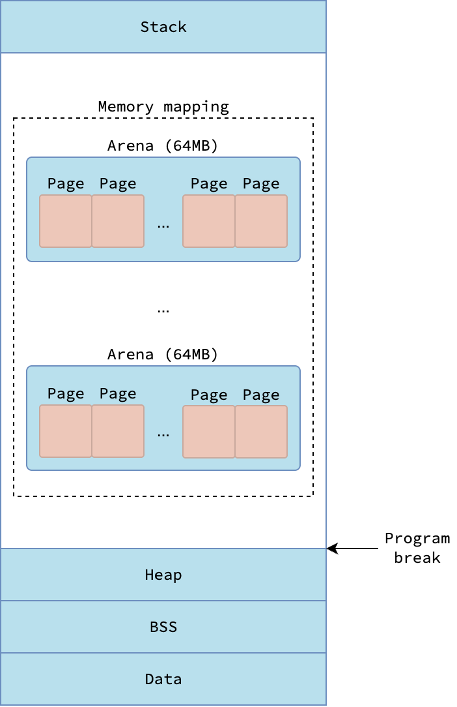

## scheduler
### go调度初始化流程
```
TEXT runtime·rt0_go(SB),NOSPLIT,$0
    // 初始化栈、TLS、argc/argv 等...
    MOVQ $runtime·g0(SB), CX     // g = &g0
    MOVQ CX, g
    MOVQ $runtime·m0(SB), AX     // m = &m0
    MOVQ AX, g_m(g)              // g0.m = &m0
    ...
    CALL runtime·schedinit(SB)
    CALL runtime·newproc(SB)
    CALL runtime·mstart(SB)

##################################
_rt0_go
└── rt0_go // 初始化m0,g0并建立 g0/m0 临时绑定，设置基本寄存器环境
	├── osinit()  // getCPUCount()、getHugePageSize()、osArchInit()、vgetrandomInit()
    ├── schedinit()     // 初始化调度器、M0, 设置最大m数量10000
    │   ├── mallocinit()                // 初始化内存分配器
    │   ├── gcinit()                    // 初始化垃圾回收器
    │   ├── 初始化 M0剩余的通用字段                     // 主线程，g0 栈
    │   │   └── mcommoninit(_g_.m)       // 初始化m剩余的通用字段
    │   │       └── allm = [M0]         // 第一个线程 M0 加入 allm
    │   └── procresize(GOMAXPROCS)      // 创建 P0~Pn
    │       ├── allp = [P0, P1, ...]   // 所有逻辑处理器
    │       └── _g_.m.p = allp[0]      // M0 绑定 P0
    │
    ├── newproc(main)                   // 创建 runtime.main 的 G, main goroutine
    │
    └── mstart()
        └── 调度循环 (scheduler loop)
            └── schedule()                  // 启动调度器，从队列中取出可运行 G 执行
                ├── findrunnable()          // 从本地队列 / 全局队列 / 偷取队列找可执行 G
                │   └── g                   // 找到的 Goroutine (runtime.main 对应的 G)
                └── execute(g)              // 高层执行 goroutine
                    └── gogo(g)             // 低层上下文切换到 g
                        └── runtime.main()  // gogo 切换栈后执行 runtime.main
                            ├── 调用用户的 main.main()
                            │       └── ... 用户函数执行 ...
                            │
                            └── runtime.goexit()   // main goroutine 执行完毕退出
                                
                            └── systemstack(newm(sysmon))   // 启动后台监控线程
                                └── newm()                  // 创建 sysmon M
                                    └── allm += [M(sysmon)]  // sysmon M 加入 allm
                                    └── sysmon()
                                        └── 后台循环监控调度器、GC、网络
```


**GMP模型**：G-goroutine，m-物理线程的封装，p-存储g，绑定到M后g可以被执行，是G眼里的cpu。

**P和M的最大值**：M最大10000，P：GOMAXPROCS限制。二者默认都是GOMAXPROCS

**调度流程**：首先是schedule()函数，调用findRunable()去寻找g，找到g后，调用gogo()切换到g上进行运行。
运行过程中，如果遇到系统调用，是异步系统调用（网络IO），就把g挂载到netpoll上，m继续执行p中其他的g。如果是同步系统调用（如基于文件的系统调用。如果你在使用 CGO，调用 C 函数也可能导致 M 阻塞），会阻塞g和m，此时将p与m分离，但是m会记录oldP，p重新寻找m以运行里面的g，如果没有可用的m，就新建。

当异步系统调用完成时，g会被放到某个P的Runnext中执行。同步系统调用返回时，会优先尝试获取m对应的oldP，不行（因为Go 的 sysmon（内部监控线程）发现有这种卡了超过 10 ms 的 M ，那么就会把 P 剥离出来，给到其他的 M 去处理执行，M 数量不够就会新创建。）就去找其他P，如果没有可用，就把g设置为可执行状态放到全局队列中，m则挂起，加入到空闲线程中。

**findRunable流程**:
1. 每61次从全局队列中取：为了公平性，防止全局队列里的g饿死。
2. 尝试从本地队列获取：先尝试从runnext上，再尝试本地队列头部取（环形数组）
3. 尝试从全局队列中获取：从头部取一批放到本地队列后返回一个。一批=min(当前队列的一半, sched.runq.size, sched.runq.size/gomaxprocs+1)
4. 尝试从netpoll获取
5. 自旋和worksteal
	- 当前 M 已自旋，或自旋线程数 < 忙碌 P 的一半，则进入/保持自旋并调用 stealWork
	- 会尝试4轮streal
		a. 随机化顺序遍历其他p，降低竞争
		b. 如果 GC 在等待，则可能有 GC goroutine 可用，直接返回。
		c. 只在最后一次迭代检查p2定时器：如果有 goroutine 因定时器就绪加入p2本地队列，优先从p2本地队列偷，偷不到就尝试偷runnext(只在最后一次才尝试偷runnext)
		d. 只从非空闲 P 窃取它的一半，放到本地队列，然后返回第一个
6. 如果还没有偷到，且在GC 标记阶段，并且有任务要做，就去标记。
7. 拍快照 allp
7. 加sched.lock，如果需要GC或runSafePointFn，就释放锁并重新循环等待执行 GC 或安全点任务。
8. 检查一遍全局队列，有就返回。
9. 如果m没在自旋，但是需要自旋，就开启自旋，然后释放锁并重新循环。
10. 分离m和p
11. （精确的跳舞）此时m没有绑定p。从 spinning → 非 spinning，关键是“先减空转计数，再重新检查全局队列，去偷其他p的，check gc work again， check timer”，保证不会丢失任何 runnable G，同时允许 M 重新成为 spinning 以维持工作保守性。
12. Poll network until next timer.
13. m挂起，放回空闲m池。同时支持唤醒后绑定新的 P 继续工作

**主动调度**：
- runtime.Gosched()
- 同步内存访问，加锁等阻塞操作
- 系统调用
- 正常执行结束角度

**抢占式调度**：
- 基于信号的抢占式调度： 
	1. sysmon（不需要p就能执行）检测到执行过长的 goroutine(10ms)、GC stw时，就会通过`preemptM() -> runtime.signalM()`对它所在的m发出`_SIGUSR1`信号进行抢占。
		- sysmon会通过`retake()`函数`stackguard0 = StackPreempt`（因为当前goroutine挂起后，可能又立即被唤醒而不是唤醒其他goroutine，该情况由协作式抢占兜底）
	2. 收到信号后，内核执行`sighandler()`函数，调用`doSigPreempt()`检查处于安全点后，通过`pushCall()`插入`asyncPreempt()`函数调用。
	3. 回到当前goroutine 执行`asyncPreempt()`函数，通过`mcall`切到`g0`栈执行`gopreempt_m`。
	4. 将当前goroutine插入到全局可运行队列，M则继续寻找其他goroutine来运行。
	5. 被抢占的goroutine再此被调度回来时，继续执行流。

- 基于协作的抢占式调度：Go会在每个函数的入口处、for 等无调用的长循环中等位置插入检测代码，比较当前的栈寄存器值和stackguard0值来决定是否触发`morestack`函数。设置了`stackguard0 = StackPreempt`作用时进入函数时必定触发`morestack`函数，然后在`morestack`中检测preempt标识触发调度。

**三个设置 stackguard0 = stackPreempt 的地方：**
- suspendG() (src/runtime/preempt.go:207)
	- 用途：GC 或调试器需要完全暂停 goroutine
	- 结果：goroutine 进入 _Gwaiting 状态
- retake() (src/runtime/proc.go:6497)
	- 用途：sysmon 定期检查，实现时间片调度
	- 结果：goroutine 进入 _Grunnable 状态，让出CPU
- mayMoreStackPreempt() (src/runtime/debug.go:217)
	- 用途：测试和调试，强制在每个点进行抢占
	- 结果：下一次栈检查时触发抢占
```
时间轴 / CPU 执行流程：

Goroutine 状态:        G1                               G2
─────────────────────────────────────────────────────────────
正常运行           ┌───────────────┐
                   │ 运行中       │
stackguard0        │ stackGuard   │
───────────────────┴───────────────┘

**调度器异步抢占**    ┌─────────────────────────────┐
signal 打断 G1      │ preemptM / asyncPreempt     │
                   │ isAsyncSafePoint? → true   │
stackguard0          stackPreempt 设置          │
───────────────────┴─────────────────────────────┘

G1 状态挂起        ┌───────────────┐
                   │ _Gscan / suspended │  <- CPU 上还未切换到 G2
stackguard0        │ stackPreempt    │
───────────────────┴───────────────┘

G1 恢复运行        ┌───────────────┐
                   │ 继续执行       │
stackguard0        │ stackPreempt  │ <- 下一次栈检查触发协作抢占
───────────────────┴───────────────┘

**协作抢占触发**      ───────────────┐
                   │ morestack() / │
                   │ suspendG()    │ <- 保证抢占可靠
───────────────────┴───────────────┘

调度器切换 G2      ┌───────────────┐
                   │ G2 开始执行    │
───────────────────┴───────────────┘


```


**sysmon的作用**：
- 释放闲置超过5分钟的span物理内存
- 如果超过2分钟没有执行垃圾回收，强制执行
- 将长时间未处理的netpoll结果添加到任务队列
- 向长时间(10ms)运行的G发出抢占调度
- 收回因同步syscall长时间阻塞的P

**GO调度的时机**
1. 使用关键字go
2. GC，因为GC的goroutine要在m上运行，所以要进行调度
3. 系统调用
4. 同步内存访问
5. 手动调用runtime.Gosched()
6. sysmon

### m的自旋
自旋 M 的数量被限制：不超过忙碌 P 数的一半

#### 什么时候m会自旋
- findRunnable 判定需要自旋
	- 条件：已经在自旋，或“自旋线程数不超过忙碌 P 数的一半”
- 有新工作提交时 wakep 启动“自旋 M”
	- 出现可运行工作，且“有空闲 P 且当前没有自旋线程”
	- wakep() 把 nmspinning 从 0 变 1，并用该 P 启动一个标记为自旋的 M
- handoffp 在没有自旋/空闲线程时拉起“自旋 M”

补充：同步原语的“自旋”
- sync.Mutex 等也会“短暂活跃自旋”（使用 procyield），但这是 G 级别的协作自旋，与上面的“调度器自旋 M”不同；其条件更保守（多核、GOMAXPROCS>1、本地 runq 空等）。
#### 有哪些类型
为了避免频繁地挂起和恢复M。分为两种自旋，二者之和不超过GOMAXPROCS
1. 有关联P的M，自旋寻找可执行的G
2. 无关联P的M，自旋寻找可用的P

当第二种自旋M存在时，第一种自旋的M不会被挂起。

### m0和g0是啥
m0 是 Go用汇编创建的第一个系统线程，再mcommoninit()中初始化，一个 Go 进程只有一个 m0，也叫主线程。

对应的实例会在全局变量runtime.m0 中，不需要在heap 上分配，M0 负责执行初始化操作和启动第一个G
### g0
|         | m0.g0                   | 普通 M.g0            |
| --------- | ----------------------- | ------------------ |
| 创建方式      | 静态全局变量                  | `malg()` 动态分配      |
| 位置        | 编译时 `.data` 段           | 堆内存（mallocgc）      |
| 绑定关系      | m0.g0 固定绑定              | 每创建一个 M，就创建一个 g0   |
| 作用        | 启动 runtime / 调度初始化都是在m0.g0的栈上执行 | 在调度、syscall、栈扩容中切换 |
| 生命周期      | 程序全程存在                  | M 结束时释放            |
| 是否参与调度    | 否                       | 否（所有 g0 都不被调度器调度）  |
| 是否可执行用户代码 | 否                       | 否                  |


**Reference:**
- [Go scheduler](https://nghiant3223.github.io/2025/04/15/go-scheduler.html)
- [Golang GMP 模型深度解析](https://blog.csdn.net/qq_44805265/article/details/152161116?spm=1001.2014.3001.5502)
- [详解Go语言调度循环源码实现](https://www.luozhiyun.com/archives/448)
- [golang 系统调用与阻塞处理](https://qiankunli.github.io/2020/11/21/goroutine_system_call.html)
- [抢占式调度](https://tiancaiamao.gitbooks.io/go-internals/content/zh/05.5.html)
- [Golang GMP 原理](https://mp.weixin.qq.com/s/jIWe3nMP6yiuXeBQgmePDg)
- [goroutine调度器揭秘 2](https://colobu.com/2024/03/24/goroutine-scheduler-2/)
- [详解Go语言调度循环源码实现](https://www.luozhiyun.com/archives/448)
- [GMP 原理与调度](https://www.topgoer.com/%E5%B9%B6%E5%8F%91%E7%BC%96%E7%A8%8B/GMP%E5%8E%9F%E7%90%86%E4%B8%8E%E8%B0%83%E5%BA%A6.html)
- [Go 语言设计与实现](https://draven.co/golang/docs/part3-runtime/ch06-concurrency/golang-goroutine/)

## 内存分配
[内存布局](https://excalidraw.com/#json=3l_PLDvVUx_aEz-oDaqSX,jvs-dvfWcYFbdIp7dApdhg)

### 堆内存分配逻辑
- 微对象 <16bytes 且不含指针: tiny allocator, mcache
- 小对象 16bytes-32kb || 含指针: span allocator， mcache
	- 根据申请的size向上取整到对应的size class对应的span。
	- 如果mspan中没有足够的空间，则mcache向mcentral（有136个，每个spanclass各一个，对应68个size class）申请新的对应span（优先从对应span的Partial SpanSet（有空闲）中分配，Full SpanSet中分配），剩余的补充到mcache自己对应的mspan中
	- 如果mcentral没有足够的内存，则向mheap申请新的span
	- 如果mheap没有足够的内存，则向操作系统申请新的内存
```
	      ┌───────────────┐
          │    MCentral   │
          └───────────────┘
                │
   ┌────────────┴────────────┐
   │                         │
partial[swept]         full[swept]
（可分配）             （已满 span）
   │
   │  GC 开始 → unswept ← GC 结束后再变 swept
   ▼
partial[unswept]
（等待 sweep）

type mcentral struct {
    partial [2]spanSet
    full    [2]spanSet
}

// 注意 [2] 是因为这两个集合会在 GC 周期间交替使用（一边读，一边写）。
// 每次 GC 完成一次标记-清扫后：partial 和 full 会互换读写角色

```
- 大对象 >32kb: mmap, mheap


### 为什么有tiny allocator
因为mcache中最小的size class=1，对应的内存是8 bytes。如果没有tiny allocator，所有int32，bool，byte等只需要一个字节的类型都会匹配size class=1的bytes空间并独享该空间，造成资源浪费。

### 内存分配相关
- goroutine栈默认大小2kb，普通线程一般是1M。
- golang中page是*8k*，linux中page是*4k*。
	- 如果对象小于 8 KB，每个页可以容纳多个相同大小的对象；如果对象大小正好为 8 KB，则每个页只容纳一个对象。大于 8 KB 的对象会跨越多个页。
- go进程的栈指的是主线程`m0`的`g0`的栈，也叫做系统栈。
- 对于小于 512 字节的对象，Go 使用mspan分配内存，并使用堆位图（heap bitmap）来跟踪跨度中哪些字包含指针
- 对于大于 512 字节的对象，维护一个大的位图效率不高。相反，每个对象都伴随着一个 8 字节的 malloc 头部——一个指向对象类型信息的指针
- Go 引入了位图摘要的概念，摘要包含三个字段： start 、 end 和 max 。 start 是位图开头连续的 0 比特数。类似地， end 是位图末尾连续的 0 比特数。最后， max 代表最大的连续 0 比特序列。摘要会在位图被修改时立即更新，即当页被分配或释放时。
- 通过合并低层级摘要，Go 隐式地构建了一个分层结构，从而能够高效地跟踪连续的空闲页。它使用一个**全局的摘要基数树**来管理整个虚拟地址空间。
- The traditional Heap segment, which is located under the program break, is not utilized by the Go runtime to allocate heap objects. Instead, Go runtime relies heavily on memory-mapped segments for allocating memory for heap objects and goroutine stacks.



### 内存分配触发GC和辅助标记GC
- 如果当前没有触发GC，当前goroutine正在执行内存分配
	- 根据当前内存分配的量来确定是否shouldhelpgc（>32K一定为true，反之则要根据是否有span不足refill）
		- 如果否就分配完内存该干嘛干嘛去就完了
		- 如果需要辅助gc，首先先计算下当前trigger（上面详细描述了如何计算的），然后比较下当前heapLive、trigger的大小
			- 如果heapLive < trigger，不用触发GC，该干嘛干嘛
			- 如果heapLive > trigger，发起GC，即调用gcStart()，这里其实是发起一轮完整的GC，等它完成后再返回来该干嘛干嘛
- 当有其他goroutine发起了GC，进入GCMark阶段后gcBlackenEnabled=1表示其他mutator要把新分配对象标记为黑，可以理解成当前进入GC阶段了
	- 每一个goroutine都要维护一个账本，自己分配了多少内存，自己辅助标记了多少内存
	- 如果自己分配的内存没有超过辅助标记的内存，gcAssistBytes>0，没欠债该干嘛干嘛去
	- 如果自己分配的内存超过自己辅助标记的内存，表示自己欠债了，欠债了怎么办？就得还债，还债就得去辅助标记内存，这就是我们说的markAssist
		- 如果我要分配npages的内存，那么要辅助扫描多少内存呢，这个运行时有个计算规则，总的目标是在GC发起后、内存占用达到heapGoal之前我能把所有的内存扫描完
		- 确定了要扫描多少内存后，就可以去干活了？等等，当前goroutine欠的债，也可以先找大佬帮还一下，这就是bgMarkWorker攒的credit（bytes），如果一次还不完，欠多少就是多少，自己去扫描就完了 ps: 这样有个好处，当前goroutine可以不用引入扫描内存的开销就可以继续干自己该干的事情。
	- 这个阶段会更新当前goroutine的这个账本，如果当前GC Cycle内它还有动作，就可以继续拿来秋后算账
### 内存泄漏的场景：
1. 子字符串造成的暂时性内存泄露
2. 子切片造成的暂时性内存泄露
3. 协程被永久阻塞而造成的永久性内存泄露
	- Go运行时很难分辨出一个处于阻塞状态的协程是永久阻塞还是暂时性阻塞
	- 有时我们可能故意永久阻塞某些协程。
4. 没有停止不再使用的time.Ticker值而造成的永久性内存泄露
	- 当一个time.Timer值不再被使用，一段时间后它将被自动垃圾回收掉。 但对于一个不再使用的time.Ticker值，我们必须调用它的Stop方法结束它，否则它将永远不会得到回收
5. 不正确地使用终结器（finalizer）而造成的永久性内存泄露（可以不用记）
6. 延迟调用函数导致的临时性内存泄露
```go
func readData() {
    data := make([]byte, 50<<20) // 50MB
    defer fmt.Println("done", len(data))

    // 模拟长时间执行的任务
    for i := 0; i < 1e8; i++ {
        _ = i * 2
    }
}

// 实际发生的事情：
// 1. data 被分配了 50MB；
// 2. defer fmt.Println 把 data 的引用捕获；
// 3. 即使循环不再使用 data；
// 4. data 在整个函数期间都不能释放；
// 5. 导致内存长时间保持 50MB 的占用。

// ✅ 它不是“真正泄露”，而是“被 defer 暂时延迟释放”。
```
**Reference：**
- [go堆内存分配](https://qiankunli.github.io/2020/11/22/go_mm.html)
- [详解Go中内存分配源码实现](https://www.luozhiyun.com/archives/434)
- [go如何触发垃圾回收的](https://www.hitzhangjie.pro/blog/2022-11-20-go%E5%A6%82%E4%BD%95%E8%A7%A6%E5%8F%91%E5%9E%83%E5%9C%BE%E5%9B%9E%E6%94%B6/)
## GC
[GC图示](../assets/GC.pdf)

`Golang`的`gc`采用*三色标记法*，从 `GcRoots` 对象开始，


`golang`在go 1.7版本之前采用了**插入写屏障**来解决漏标的问题。但需要在标记终止阶段 STW 时对这些栈进行重新扫描（re-scan）。原因如下所描述（由于没有 栈写屏障（stack write barrier），垃圾回收器在扫描栈时，不能保证这些指针在扫描之后不会被 Goroutine 改变，所以需要re-scan）：

> without stack write barriers, we can‘t ensure that the stack won’t later contain a reference to a white object, so a scanned stack is only black until its goroutine executes again, at which point it conservatively reverts to grey. Thus, at the end of the cycle, the garbage collector must re-scan grey stacks to blacken them and finish marking any remaining heap pointers.

### 三色标记法
三色标记法将对象的颜色分为了黑、灰、白，三种颜色。

- 黑色：该对象已经被标记过了，且该对象下的属性也全部都被标记过了（程序所需要的对象）；
- 灰色：该对象已经被标记过了，但该对象下的属性没有全被标记完（GC需要从此对象中去寻找垃圾）；
- 白色：该对象没有被标记过（对象垃圾）。

在垃圾收集器开始工作时，从 GC Roots 开始进行遍历访问，访问步骤可以分为下面几步：
1. GC Roots 根对象会被标记成灰色；
2. 然后从灰色集合中获取对象，将其标记为黑色，将该对象引用到的对象标记为灰色；
3. 重复步骤2，直到没有灰色集合可以标记为止；
4. 结束后，剩下的没有被标记的白色对象即为 GC Roots 不可达，可以进行回收。

由于标记阶段 `user goroutine` 和 `gc goroutine` 并发运行，所以会产生*漏标*或者*多标*的情况。
- *多标*：a->b, a是黑，b是灰，之后接触a对b的引用，此时已经没有对象引用b。但由于b已经是灰色，最终会变成黑色。导致该被gc回收但是没有。不过下一轮gc会回收它，所以问题不严重，先不用管。
- *漏标*：a, b, c。a为黑色，b为灰色，c为白色，初始时：b->c。改成a->c, 断开b和c。由于a已经标记为黑色不会再遍历，b也不指向c了，所以c遍历不到，但因为是白色，所以会被清除。不能接受的场景。

所以引入了屏障技术来解决。

### GoRoots
- 全局变量
- 执行栈
- 寄存器

### 强弱三色不变性：
- **强三色不变性**：白色对象不能被黑色对象直接引用。插入写屏障（Dijkstra）的目标是实现强三色不变式，保证当一个黑色对象指向一个白色对象前，会先触发屏障将白色对象置为灰色，再建立引用.
- **弱三色不变形**：白色对象可以被黑色对象引用，但要从某个灰对象出发仍然可达该白对象。删除写屏障（Yuasa barrier）的目标是实现弱三色不变式，保证当一个白色对象即将被上游删除引用前，会触发屏障将其置灰，之后再删除上游指向其的引用.

都是用来解决*漏标*问题的。
### 内存屏障
#### 插入写屏障
满足了强三色不变性

如果该对象是白色的话，shade(ptr)会将对象标记成灰色。这样可以保证强三色不变性，它会保证 ptr 指针指向的对象在赋值给 *slot 前不是白色。
```go
writePointer(slot, ptr):
    shade(ptr)
    *slot = ptr
```

**缺点**：需要在标记终止阶段 STW 时对这些栈进行重新扫描（re-scan），因为没有 栈写屏障（stack write barrier），垃圾回收器在扫描栈时，不能保证这些指针在扫描之后不会被 Goroutine 改变

#### 删除写屏障
满足了弱三色不变性

为了防止丢失从灰色对象到白色对象的路径，应该假设 *slot 可能会变为黑色， 为了确保 ptr 不会在被赋值到 *slot 前变为白色，shade(*slot) 会先将 *slot 标记为灰色， 进而该写操作总是创造了一条灰色到灰色或者灰色到白色对象的路径，这样删除写屏障就可以保证弱三色不变性，老对象引用的下游对象一定可以被灰色对象引用。
```go
writePointer(slot, ptr)
    shade(*slot)
    *slot = ptr
```
 
#### 混合写屏障
> the write barrier shades the object whose reference is being overwritten, and, if the current goroutine's stack has not yet been scanned, also shades the reference being installed.
>
> 对正在被覆盖的对象进行着色，且如果当前栈未扫描完成， 则同样对指针进行着色。
```go
// 论文中
writePointer(slot, ptr):
    shade(*slot)
    if current stack is grey:
        shade(ptr)
    *slot = ptr 

// golang实际
writePointer(slot, ptr):
	// 旧值 置灰
    shade(*slot)
	// 新值 置灰
    shade(ptr)
    *slot = ptr
```

#### 混合屏障规则具体操作
- GC 开始前扫描栈：在 GC 开始时，将栈上所有活动（可达）的对象扫描并标记为黑色。此后不再需要对栈进行第二次扫描，也无需停顿（STW）来保证栈上的对象不丢失。
- GC 期间栈的标记：在 GC 过程中，任何在栈上新创建的对象，都会被标记为黑色。
- GC 期间堆的标记：
	- 被删除的对象：在堆上被删除的对象，会被标记为灰色。
	- 新添加的对象：在堆上新添加的对象，会被标记为灰色
### GC触发的时机
- 阈值触发（内存分配时触发， `runtime.mallocgc`）（gcTriggerHeap）
- 定时触发 （sysmon 定时检查调用 `runtime.forcegchelper`）（gcTriggerTime）
- 手动触发`runtime.GC`（gcTriggerCycle）
```go
// test reports whether the trigger condition is satisfied, meaning
// that the exit condition for the _GCoff phase has been met. The exit
// condition should be tested when allocating.
func (t gcTrigger) test() bool {
	if !memstats.enablegc || panicking.Load() != 0 || gcphase != _GCoff {
		return false
	}
	switch t.kind {
	case gcTriggerHeap:
		// 当前已分配堆大小 ≥ 触发阈值
		trigger, _ := gcController.trigger()
		return gcController.heapLive.Load() >= trigger
	case gcTriggerTime:
		if gcController.gcPercent.Load() < 0 {
			return false
		}
		// 距离上次 GC 时间超过 forcegcperiod（默认 2 分钟）。
		lastgc := int64(atomic.Load64(&memstats.last_gc_nanotime))
		return lastgc != 0 && t.now-lastgc > forcegcperiod
	case gcTriggerCycle:
		// 目标 GC 周期数 (t.n) 大于当前已执行的周期数 (work.cycles)
		// 内部调度/测试用途，可以强制进入某个 GC 周期
		// t.n > work.cycles, but accounting for wraparound.
		return int32(t.n-work.cycles.Load()) > 0
	}
	return true
}
```
### GC的阶段
1.  执行 Sweep 终止阶段
	1. 停止世界（STW），让所有 P 到达 GC 安全点。  
	2. 清扫尚未清扫的内存 span。只有在本次 GC 被提前触发时，才会有未清扫的 span。  

2. 执行标记阶段（Mark Phase）
	1. 设置 `gcphase` 为 `_GCmark`（从 `_GCoff` 切换），启用写屏障，允许 mutator 辅助，并入队根对象标记任务。在所有 P 启用写屏障前，不允许扫描任何对象，这通过 STW 完成。  

	2. 启动世界（恢复 mutator 运行）。从此刻起，GC 工作由调度器启动的标记工作线程（mark workers）以及分配过程中 mutator 的辅助完成。写屏障会“染色”被覆盖的旧指针和写入的新指针（详见 `mbarrier.go`）。新分配的对象立即标记为黑色。  

	3. 执行根对象标记任务，包括扫描所有栈、标记全局变量以及 runtime 中堆外结构的指针。扫描栈会暂停对应的 Goroutine，标记其栈上的指针，然后恢复该 Goroutine。  

	4. GC 排干灰色对象工作队列，将每个灰色对象标记为黑色，并标记其中的指针（这些指针可能被加入工作队列）。  

	5. 因为 GC 工作分散在局部缓存，使用分布式终止算法判断是否还有根对象标记任务或灰色对象（`gcMarkDone`）。此时，GC 进入标记终止阶段。  

3. 标记终止阶段（Mark Termination）
	1. 停止世界。  

	2. 设置 `gcphase` 为 `_GCmarktermination`，禁用工作线程和辅助。  

	3. 执行清理工作，例如刷新 mcaches。  

4. 清扫阶段（Sweep Phase）
	1. 设置 `gcphase` 为 `_GCoff`，初始化清扫状态并禁用写屏障。  

	2. 启动世界。此时新分配对象为白色，如果需要，分配前先清扫 span。  

	3. GC 在后台进行并发清扫，也在分配时触发清扫。


**mutator assists**：GC 标记的工作是分配 25% 的 CPU 来进行 GC 操作，所以有可能 GC 的标记工作线程比应用程序的分配内存慢，导致永远标记不完，那么这个时候就需要应用程序的线程来协助完成标记工作。
Reference:
- [go如何触发垃圾回收的](https://www.hitzhangjie.pro/blog/2022-11-20-go%E5%A6%82%E4%BD%95%E8%A7%A6%E5%8F%91%E5%9E%83%E5%9C%BE%E5%9B%9E%E6%94%B6/)
- [Garbage Collection In Go : Part I - Semantics](https://www.ardanlabs.com/blog/2018/12/garbage-collection-in-go-part1-semantics.html)
## Mutex
在可以快速处理的简单临界资源中, `mutex` 的性能几乎和 `atomic` 一样.这是因为 `mutex` 是用*乐观思想优化过的悲观锁*,当发生竞态时,会自旋 4 次,在自旋的过程中,锁可能就被释放了.所以性能几乎相差无几.


```go
type Mutex struct {
	state int32
	sema  uint32
}

mutexLocked = 1 << iota // mutex is locked
mutexWoken
mutexStarving
mutexWaiterShift = iota
```
`sema` 是用来管理 goroutine 阻塞与唤醒的机制，保证当锁不可用时，goroutine 可以安全地挂起，并在锁释放时被唤醒重新尝试获取锁。它是 Mutex 的慢路径核心，负责解决并发下的等待问题。**阻塞的队列也是通过信号量由runtime维护的**

`state`是一个int32的字段，低三位分别表示：是否加锁、是否有唤醒的goroutine、是否饥饿模式，其他位表示等待锁的goroutine数量。

### 加锁逻辑
**lock** 操作分位 *fast path* 和 *slow path*，*fast path* 是通过`cas`获取锁，失败后进入 *slow path*。

**slow path：**
互斥锁（Mutex）有两种运行模式：*正常模式*和*饥饿模式*。
- 在*正常模式*下，等待者会按 FIFO（先进先出）顺序排队，
但被唤醒的等待者并不会直接获得互斥锁，而是要和新到达的
Goroutine 一起竞争锁的所有权。新来的 Goroutine 有优势，
因为它们已经在 CPU 上运行，并且可能数量很多，
所以被唤醒的等待者很容易竞争失败。在这种情况下，
它会被重新放到等待队列的前端。如果一个等待者超过 1ms
都没能成功获取互斥锁，那么互斥锁会切换到饥饿模式。

- 在*饥饿模式*下，互斥锁的所有权会直接从解锁的 Goroutine
转交给等待队列头部的 Goroutine。新到达的 Goroutine
即使看到互斥锁是未加锁状态，也不会去尝试获取，
也不会自旋，而是直接排到等待队列的尾部。

**切回正常模式**：如果某个等待者获得了互斥锁，并且它发现：它是**队列中最后一个等待者**，或者**它的实际等待时间少于 1ms**那么互斥锁会切换回*正常模式*。

正常模式的性能要好得多，因为 Goroutine 可以连续多次
获得互斥锁，即使此时还有其他等待者。
而饥饿模式的意义在于避免极端情况下的尾部延迟问题。

PS: 饥饿模式是为了公平，避免 goroutine 长时间获取不到锁


工作模式：Mutex 有两种工作模式：

- 正常模式 （Normal Mode）：
	1. 当一个 goroutine 请求锁时，如果锁未被持有，它会立即获得锁。
	2. 如果锁已被持有，它会通过4次**自旋**尝试获取锁。自旋是指在不挂起 goroutine 的情况下，进行忙等待循环。这对于锁很快会被释放的场景能提升性能。
	3. 如果自旋后仍未获取到锁，goroutine 会被加入等待队列并挂起。
	4. 当锁被释放时，会唤醒等待队列中的一个 goroutine。被唤醒的goroutine 和新来的goroutine 会公平竞争。
- 饥饿模式（Starving Mode）：
	1. 如果一个 goroutine 等待锁的时间超过了 1ms，`Mutex` 会切换到饥饿模式。
	2. 在饥饿模式下，锁的所有权会直接交接给等待队列中的队头 goroutine，新来的goroutine 即使自旋也无法获取锁。
	3. 目的：防止等待队列中的 goroutine 因为不断有新来的“插队者”而长时间“饿死”保证了公平性。
### 指令重排
为了提高cpu指令吞吐

#### 内存屏障
用来解决执行重排带来的部分不利影响。用来阻止屏障前后的指令共同参与重排序，保证屏障后的指令不会出现在屏障前执行，保证屏障前的指令不会在屏障后执行。相当于屏障之前和之后确立了happens-before关系，保证了屏障之前的操作对屏障之后的操作都是可见的。

#### happens-before
Happens-before (HB) 是并发编程里的一个核心概念，用来描述 操作之间的可见性和顺序关系。

**定义**：
- 如果操作 A happens-before 操作 B，那么 B 一定 能看到 A 的结果，即 A 的所有副作用对 B 可见。
- 如果 A 和 B 之间没有 happens-before 关系，它们是 data race 的潜在源，因为没有同步保证。

**特点**：
- 传递性：如果 A → B 且 B → C，那么 A → C。
- 同步操作建立 HB：原子操作、锁、通道通信等可以建立 HB。
- 无 HB：可能出现重排序或不可见状态。


**golang中的HB体现**：Go 官方在 Memory Model
中明确了 HB 的规则，主要通过 同步原语 建立 HB 关系
- Mutex / RWMutex
- Channel 发送接收
- WaitGroup / Cond
- 原子操作 (atomic)

#### cas
CAS 是一种 原子操作，用于多线程/多 goroutine 下安全地修改共享变量。底层是CPU 提供的原子指令`lock`。

操作步骤：
1. 读取内存地址 addr 的当前值 v
2. 比较 v 和期望值 old：
3. 如果相等 → 交换 v 为 new，返回 true
4. 如果不等 → 不修改，返回 false

通过cpu的`lock`指令保证原子性。通过
**用途：**
- 实现无锁算法
- 实现互斥锁、计数器等并发数据结构

**CAS 的局限性**：

- ABA 问题：如果值从 A → B → A，CAS 会误认为没变化，导致错误。解决方案：加版本号（如 atomic.Value 或指针+计数器）

- 自旋开销：
    - CAS 失败频繁自旋 → CPU 占用高

- 只能操作单个内存位置，复杂结构需要多 CAS 或锁

**ABA问题**：实际上中间已经发生了变化（A → B → A），但是另一个线程未发现。
1. 一个线程读取共享变量 V 的值，假设是 A。
2. 在该线程还未执行 CAS 前，其他线程把 V 从 A 改成 B，又改回 A。
3. 第一个线程执行 CAS 时，看到的仍然是 A，认为没有变化，于是 CAS 成功。

**Reference:**
- [浅析 Golang Mutex 源码 基于 Golang 1.21.0](https://zhuanlan.zhihu.com/p/661380439)
## Slice
### go1.18之前
1. 如果期望容量大于旧的容量的两倍，直接用期望容量
2. 如果旧容量小于1024，直接翻倍
3. 否则，每次增长1.25倍，直到足够。
```go
func growslice(et *_type, old slice, cap int) slice {
    ...

	newcap := old.cap
	doublecap := newcap + newcap
	if cap > doublecap {
		newcap = cap
	} else {
		if old.cap < 1024 {
			newcap = doublecap
		} else {
			// Check 0 < newcap to detect overflow
			// and prevent an infinite loop.
			for 0 < newcap && newcap < cap {
				newcap += newcap / 4
			}
			// Set newcap to the requested cap when
			// the newcap calculation overflowed.
			if newcap <= 0 {
				newcap = cap
			}
		}
	}

	...
}
```

### go1.18之后
1. `newLen`>`2*oldCap`，返回`newLen`
2. `oldCap`< threshold=256，返回 `2 * oldCap`
3. 在当前`cap`基础上循环累加`(cap + 3*256)>>2`，直到满足`newLen`。更加平滑了。
```go
func growslice(oldPtr unsafe.Pointer, newLen, oldCap, num int, et *_type) slice {
    ...
    newcap := nextslicecap(newLen, oldCap)
    ...
}

func nextslicecap(newLen, oldCap int) int {
	newcap := oldCap
	doublecap := newcap + newcap
	if newLen > doublecap {
		return newLen
	}

	const threshold = 256
	if oldCap < threshold {
		return doublecap
	}
	for {
		// Transition from growing 2x for small slices
		// to growing 1.25x for large slices. This formula
		// gives a smooth-ish transition between the two.
		newcap += (newcap + 3*threshold) >> 2

		// We need to check `newcap >= newLen` and whether `newcap` overflowed.
		// newLen is guaranteed to be larger than zero, hence
		// when newcap overflows then `uint(newcap) > uint(newLen)`.
		// This allows to check for both with the same comparison.
		if uint(newcap) >= uint(newLen) {
			break
		}
	}

	// Set newcap to the requested cap when
	// the newcap calculation overflowed.
	if newcap <= 0 {
		return newLen
	}
	return newcap
}
```
结论：
- `newLen`大于两倍的`oldCap`，扩容到`newLen`
- `oldCap`小于256，扩容到`2*oldCap`
- 否则在当前`cap`基础上循环累加`(cap + 3*256)>>2`，直到满足`newLen`
## Map
### go1.24之前
```go
// A header for a Go map.
type hmap struct {
	count     int // # size of map.  Must be first (used by len() builtin)
	flags     uint8
	B         uint8  // log_2 of # of buckets (can hold up to loadFactor * 2^B items)
	noverflow uint16 // approximate number of overflow buckets; see incrnoverflow for details
	hash0     uint32 // hash seed

	buckets    unsafe.Pointer // array of 2^B Buckets. may be nil if count==0.
	oldbuckets unsafe.Pointer // previous bucket array of half the size, non-nil only when growing
	nevacuate  uintptr        // progress counter for evacuation (buckets less than this have been evacuated)
	clearSeq   uint64

	extra *mapextra // optional fields
}

// A bucket for a Go map.
type bmap struct {
	// tophash generally contains the top byte of the hash value
	// for each key in this bucket. If tophash[0] < minTopHash,
	// tophash[0] is a bucket evacuation state instead.
	tophash [abi.OldMapBucketCount]uint8
	// Followed by bucketCnt keys and then bucketCnt elems.
	// NOTE: packing all the keys together and then all the elems together makes the
	// code a bit more complicated than alternating key/elem/key/elem/... but it allows
	// us to eliminate padding which would be needed for, e.g., map[int64]int8.
	// Followed by an overflow pointer.
}

// 因为哈希表中可能存储不同类型的键值对，go bmap的原代码不可能知道用户使用什么类型，所以只能编译期重建。
// bmap编译期被还原成如下：
type bmap struct {
    topbits  [8]uint8
    keys     [8]keytype
    values   [8]valuetype
    pad      uintptr
    overflow uintptr
}
```
#### 赋值
```go
func mapassign(t *maptype, h *hmap, key unsafe.Pointer) unsafe.Pointer {
    if h == nil {
        panic(plainError("assignment to entry in nil map"))
    }
    ...
    if h.flags&hashWriting != 0 { // 并发写冲突检查，说明 map 不是并发安全的
		fatal("concurrent map writes")
	}
    hash := t.Hasher(noescape(unsafe.Pointer(&key)), uintptr(h.hash0))

    // Set hashWriting after calling t.hasher, since t.hasher may panic,
	// in which case we have not actually done a write. 
	h.flags ^= hashWriting // 写操作标记写入状态，说明 map 是有状态的

    if h.buckets == nil {
		h.buckets = newobject(t.Bucket) // newarray(t.bucket, 1)
	}

again:
	bucket := hash & bucketMask(h.B) // 取哈希值低 B 位，计算 key 应该放到哪个桶中
	if h.growing() { 
		growWork(t, h, bucket) // 渐进式搬迁旧桶。搬迁当前桶对应旧桶，并额外再搬一个桶。它们链接的所有溢出桶一起迁移。
	}
	b := (*bmap)(add(h.buckets, bucket*uintptr(t.BucketSize)))
	top := tophash(hash) // 取哈希值的高 8 位

	var insertb *bmap
	var inserti uintptr
	var insertk unsafe.Pointer
bucketloop:
	for {
		for i := uintptr(0); i < abi.MapBucketCount; i++ { // 遍历8个槽位
			// 槽位的 tophash 和 键值的 tophash 不一致,可能是个空槽位.
			if b.tophash[i] != top { 
				if isEmpty(b.tophash[i]) && inserti == nil {
                    // 记录空槽的位置。注意：这里说明在 tophash 和某个已存在的key 的 tophash 冲突时，会优先放到同一个桶的其他槽里。即开放地址法解决哈希冲突。
					inserti = &b.tophash[i]
					insertk = add(unsafe.Pointer(b), dataOffset+i*uintptr(t.KeySize))
					elem = add(unsafe.Pointer(b), dataOffset+abi.MapBucketCount*uintptr(t.KeySize)+i*uintptr(t.ValueSize))
				}
				if b.tophash[i] == emptyRest { 
                    // 从当前槽到桶尾都是空的，可以提前 break。跳出bucketloop中所有循环，去执行
                    // if !h.growing() && (overLoadFactor(h.count+1, h.B) || tooManyOverflowBuckets(h.noverflow, h.B))
					break bucketloop
				}
				continue 因为该槽位的 tophash 不等于 key 的 top，且没有命中提前结束的条件，所以去看下一个槽位。
			}
            // 已经找到了对应的槽
			k := add(unsafe.Pointer(b), dataOffset+i*uintptr(t.KeySize))
			if t.IndirectKey() {
				k = *((*unsafe.Pointer)(k))
			}
            // 该位置的 key 和 我们的key不相等，继续找
			if !t.Key.Equal(key, k) {
				continue
			}
			// already have a mapping for key. Update it.
            // 找到了
			if t.NeedKeyUpdate() {
				typedmemmove(t.Key, k, key)
			}
			elem = add(unsafe.Pointer(b), dataOffset+abi.MapBucketCount*uintptr(t.KeySize)+i*uintptr(t.ValueSize))
			goto done
		}
        // 普通桶里没有找到，看下溢出桶
		ovf := b.overflow(t)
		if ovf == nil {
			break
		}
		b = ovf
	}

    // Did not find mapping for key. Allocate new cell & add entry.

	// If we hit the max load factor or we have too many overflow buckets,
	// and we're not already in the middle of growing, start growing.
    // 桶扩容的条件：命中了最大负载因子或溢出桶太多
    // - 负载因子：6.5
    // - 溢出桶太多
    //    - 如果 B 特别大，溢出桶阈值也会非常大，这里把 B 限制到最大 15
    //    - 如果溢出桶数 >= 主桶数，就算“太多”
	if !h.growing() && (overLoadFactor(h.count+1, h.B) || tooManyOverflowBuckets(h.noverflow, h.B)) {
		hashGrow(t, h)
		goto again // Growing the table invalidates everything, so try again
	}

	if inserti == nil {
		// The current bucket and all the overflow buckets connected to it are full, allocate a new one.
        // 当前桶和溢出桶都满了，分配新的桶。
		newb := h.newoverflow(t, b)
		inserti = &newb.tophash[0]
		insertk = add(unsafe.Pointer(newb), dataOffset)
		elem = add(insertk, abi.MapBucketCount*uintptr(t.KeySize))
	}

	// store new key/elem at insert position
	if t.IndirectKey() {
		kmem := newobject(t.Key)
		*(*unsafe.Pointer)(insertk) = kmem
		insertk = kmem
	}
	if t.IndirectElem() {
		vmem := newobject(t.Elem)
		*(*unsafe.Pointer)(elem) = vmem
	}
	typedmemmove(t.Key, insertk, key)
	*inserti = top
	h.count++

done:
	if h.flags&hashWriting == 0 {
		fatal("concurrent map writes")
	}
	h.flags &^= hashWriting
	if t.IndirectElem() {
		elem = *((*unsafe.Pointer)(elem))
	}
	return elem
}
```
总结：
1. 赋值会检查是否并发写，并发就报错。
2. 对 key 进行 hash，用后 *B* 位找到对应的桶，并判断当前如果处在扩容期间就进行当前桶的数据迁移，并额外再搬一个桶。它们链接的所有溢出桶一起迁移。
3. 用 hash 值的*高8位*找到对应的槽并判断key是否一致，最后找到空槽或者 key 相等的。PS：对应uint64、uint32等类型不会用 hash 值的高8位，而是直接用key。
4. 判断是否需要扩容，需要就扩容。桶扩容的条件：命中了最大负载因子或溢出桶太多
- 负载因子：6.5
- 溢出桶太多
   - 如果 B 特别大，溢出桶阈值也会非常大，这里把 B 限制到最大 15。
   		- 加倍扩容。一个桶的元素会放到两个新桶里。
   - 如果溢出桶数 >= 主桶数，就算“太多”
    	- 等量扩容。把存储稀疏的kv，更集中的存放
5. 如果找到应该存的桶和对应的溢出桶都满了，就创建新的桶
6. 插入元素。
7. h.flags &^= hashWriting，位清除。

#### 数据迁移
一次迁移一个桶，并把对应的溢出桶也迁移了
```go
func growWork(t *maptype, h *hmap, bucket uintptr) {
	// make sure we evacuate the oldbucket corresponding
	// to the bucket we're about to use
	evacuate(t, h, bucket&h.oldbucketmask())

	// evacuate one more oldbucket to make progress on growing
	if h.growing() {
		evacuate(t, h, h.nevacuate)
	}
}

func evacuate(t *maptype, h *hmap, oldbucket uintptr) {
	b := (*bmap)(add(h.oldbuckets, oldbucket*uintptr(t.BucketSize)))
	newbit := h.noldbuckets()
	if !evacuated(b) {
		// TODO: reuse overflow buckets instead of using new ones, if there
		// is no iterator using the old buckets.  (If !oldIterator.)

		// xy contains the x and y (low and high) evacuation destinations.
		var xy [2]evacDst
		x := &xy[0]
		x.b = (*bmap)(add(h.buckets, oldbucket*uintptr(t.BucketSize)))
		x.k = add(unsafe.Pointer(x.b), dataOffset)
		x.e = add(x.k, abi.MapBucketCount*uintptr(t.KeySize))

		if !h.sameSizeGrow() {
			// Only calculate y pointers if we're growing bigger.
			// Otherwise GC can see bad pointers.
			y := &xy[1]
			y.b = (*bmap)(add(h.buckets, (oldbucket+newbit)*uintptr(t.BucketSize)))
			y.k = add(unsafe.Pointer(y.b), dataOffset)
			y.e = add(y.k, abi.MapBucketCount*uintptr(t.KeySize))
		}

        // 说明把溢出桶也一起迁移了
		for ; b != nil; b = b.overflow(t) {
			k := add(unsafe.Pointer(b), dataOffset)
			e := add(k, abi.MapBucketCount*uintptr(t.KeySize))
			for i := 0; i < abi.MapBucketCount; i, k, e = i+1, add(k, uintptr(t.KeySize)), add(e, uintptr(t.ValueSize)) {
				top := b.tophash[i]
				if isEmpty(top) {
					b.tophash[i] = evacuatedEmpty
					continue
				}
				if top < minTopHash {
					throw("bad map state")
				}
				k2 := k
				if t.IndirectKey() {
					k2 = *((*unsafe.Pointer)(k2))
				}
				var useY uint8
				if !h.sameSizeGrow() {
					// Compute hash to make our evacuation decision (whether we need
					// to send this key/elem to bucket x or bucket y).
					hash := t.Hasher(k2, uintptr(h.hash0))
					if h.flags&iterator != 0 && !t.ReflexiveKey() && !t.Key.Equal(k2, k2) {
						// If key != key (NaNs), then the hash could be (and probably
						// will be) entirely different from the old hash. Moreover,
						// it isn't reproducible. Reproducibility is required in the
						// presence of iterators, as our evacuation decision must
						// match whatever decision the iterator made.
						// Fortunately, we have the freedom to send these keys either
						// way. Also, tophash is meaningless for these kinds of keys.
						// We let the low bit of tophash drive the evacuation decision.
						// We recompute a new random tophash for the next level so
						// these keys will get evenly distributed across all buckets
						// after multiple grows.
						useY = top & 1
						top = tophash(hash)
					} else {
						if hash&newbit != 0 {
							useY = 1
						}
					}
				}

				if evacuatedX+1 != evacuatedY || evacuatedX^1 != evacuatedY {
					throw("bad evacuatedN")
				}

				b.tophash[i] = evacuatedX + useY // evacuatedX + 1 == evacuatedY
				dst := &xy[useY]                 // evacuation destination

				if dst.i == abi.MapBucketCount {
					dst.b = h.newoverflow(t, dst.b)
					dst.i = 0
					dst.k = add(unsafe.Pointer(dst.b), dataOffset)
					dst.e = add(dst.k, abi.MapBucketCount*uintptr(t.KeySize))
				}
				dst.b.tophash[dst.i&(abi.MapBucketCount-1)] = top // mask dst.i as an optimization, to avoid a bounds check
				if t.IndirectKey() {
					*(*unsafe.Pointer)(dst.k) = k2 // copy pointer
				} else {
					typedmemmove(t.Key, dst.k, k) // copy elem
				}
				if t.IndirectElem() {
					*(*unsafe.Pointer)(dst.e) = *(*unsafe.Pointer)(e)
				} else {
					typedmemmove(t.Elem, dst.e, e)
				}
				dst.i++
				// These updates might push these pointers past the end of the
				// key or elem arrays.  That's ok, as we have the overflow pointer
				// at the end of the bucket to protect against pointing past the
				// end of the bucket.
				dst.k = add(dst.k, uintptr(t.KeySize))
				dst.e = add(dst.e, uintptr(t.ValueSize))
			}
		}
		// Unlink the overflow buckets & clear key/elem to help GC.
		if h.flags&oldIterator == 0 && t.Bucket.Pointers() {
			b := add(h.oldbuckets, oldbucket*uintptr(t.BucketSize))
			// Preserve b.tophash because the evacuation
			// state is maintained there.
			ptr := add(b, dataOffset)
			n := uintptr(t.BucketSize) - dataOffset
			memclrHasPointers(ptr, n)
		}
	}

	if oldbucket == h.nevacuate {
		advanceEvacuationMark(h, t, newbit)
	}
}
```
**map中解决hash冲突（tophash冲突，不是key冲突）的方法**：优先用开放地址法，如果应该放的桶里没有空余的槽，才会链地址法。

**新旧数据迁移在什么时候**：渐进式迁移，在赋值mapassign、删除mapdelete时。
### go1.24之后

**什么是SIMD**：（Single Instruction Multiple Data）单指令多数据流。是一种并行计算技术，可以同时对多个数据执行相同的操作。使用 SIMD 的主要目的是为了提升计算性能。
**Referrence:**
<!-- 1.24之前 -->
- [浅谈Golang 1.21.0 map源码](https://zhuanlan.zhihu.com/p/653518993)
- [GoLang Map 实现分析](https://blog.csdn.net/cugriver/article/details/126276610)
<!-- 1.24之后 -->
- [Faster Go maps with Swiss Tables](https://go.dev/blog/swisstable)
- [How Go 1.24's Swiss Tables saved us hundreds of gigabytes](https://www.datadoghq.com/blog/engineering/go-swiss-tables/)
- [Go 1.24用户报告：Datadog如何借助 Swiss Tables版map节省数百 GB 内存？](https://tonybai.com/2025/07/22/go-swiss-table-map-user-report/)
- [Map internals in Go 1.24](https://themsaid.com/map-internals-go-1-24?utm_source=chatgpt.com)
## Channel
`channel`使用 `mutex` 来保障并发安全。 无缓冲的channel是同步的，而有缓冲的channel是非同步的 

对于有缓冲的`channel` 内部是一个循环数组，如果队列满了，新的sender被放入 `sendq`, 如果队列空了，receiver 被放到 `recvq` 中。
- 元素无指针：`hchan` + `buf` 一起分配
- 元素有指针：`hchan` 与 `buf` 分开分配，让 GC 能扫描元素。
对于无缓冲的 `channel` 之分配 `hchan`，不分配 `buf`。

**常见情况**:
- panic场景：
	- 关闭一个已关闭的channel
	- 向关闭的 chan 发送数据也会 panic
	- 关闭一个nil的channel
- 阻塞场景：
	- send to 无缓冲 channel，但是没有接收者
	- read from 无缓冲 channel，但是没有发送者
	- 接收时，buffer为空且 sendq 为空
	- 发送时，buffer满了且 recvq 为空

- 怎么传递：Go channel 尽量保证 FIFO，但 在高并发和缓冲区满 + 等待接收者的情况下，严格 FIFO 不一定成立。
	- 如果 `recvq` 不为空，直接从 sender 给 receiver，绕过缓冲区。
	- 其他情况先放到缓冲区，然后`receiver`再取走

```go
type hchan struct {
	qcount   uint           // total data in the queue
	dataqsiz uint           // size of the circular queue
	buf      unsafe.Pointer // points to an array of dataqsiz elements
	elemsize uint16
	closed   uint32
	timer    *timer // timer feeding this chan
	elemtype *_type // element type
	sendx    uint   // send index
	recvx    uint   // receive index
	recvq    waitq  // list of recv waiters
	sendq    waitq  // list of send waiters
	bubble   *synctestBubble

	// lock protects all fields in hchan, as well as several
	// fields in sudogs blocked on this channel.
	//
	// Do not change another G's status while holding this lock
	// (in particular, do not ready a G), as this can deadlock
	// with stack shrinking.
	lock mutex
}

type waitq struct {
	first *sudog
	last  *sudog
}

type sudog struct {
	// The following fields are protected by the hchan.lock of the
	// channel this sudog is blocking on. shrinkstack depends on
	// this for sudogs involved in channel ops.

	g *g

	next *sudog
	prev *sudog
	elem unsafe.Pointer // data element (may point to stack)

	// The following fields are never accessed concurrently.
	// For channels, waitlink is only accessed by g.
	// For semaphores, all fields (including the ones above)
	// are only accessed when holding a semaRoot lock.

	acquiretime int64
	releasetime int64
	ticket      uint32

	// isSelect indicates g is participating in a select, so
	// g.selectDone must be CAS'd to win the wake-up race.
	isSelect bool

	// success indicates whether communication over channel c
	// succeeded. It is true if the goroutine was awoken because a
	// value was delivered over channel c, and false if awoken
	// because c was closed.
	success bool

	// waiters is a count of semaRoot waiting list other than head of list,
	// clamped to a uint16 to fit in unused space.
	// Only meaningful at the head of the list.
	// (If we wanted to be overly clever, we could store a high 16 bits
	// in the second entry in the list.)
	waiters uint16

	parent   *sudog // semaRoot binary tree
	waitlink *sudog // g.waiting list or semaRoot
	waittail *sudog // semaRoot
	c        *hchan // channel
}
```

### 初始化channel
```go
func makechan(t *chantype, size int) *hchan {
	elem := t.Elem

	// compiler checks this but be safe.
	if elem.Size_ >= 1<<16 {
		throw("makechan: invalid channel element type")
	}
	if hchanSize%maxAlign != 0 || elem.Align_ > maxAlign {
		throw("makechan: bad alignment")
	}

	mem, overflow := math.MulUintptr(elem.Size_, uintptr(size))
	if overflow || mem > maxAlloc-hchanSize || size < 0 {
		panic(plainError("makechan: size out of range"))
	}

	// Hchan does not contain pointers interesting for GC when elements stored in buf do not contain pointers.
	// buf points into the same allocation, elemtype is persistent.
	// SudoG's are referenced from their owning thread so they can't be collected.
	// TODO(dvyukov,rlh): Rethink when collector can move allocated objects.
	var c *hchan
	switch {
	case mem == 0:
		// Queue or element size is zero.
		c = (*hchan)(mallocgc(hchanSize, nil, true))
		// Race detector uses this location for synchronization.
		c.buf = c.raceaddr()
	case !elem.Pointers():
		// Elements do not contain pointers.
		// Allocate hchan and buf in one call.
		c = (*hchan)(mallocgc(hchanSize+mem, nil, true))
		c.buf = add(unsafe.Pointer(c), hchanSize)
	default:
		// Elements contain pointers.
		c = new(hchan)
		c.buf = mallocgc(mem, elem, true)
	}

	c.elemsize = uint16(elem.Size_)
	c.elemtype = elem
	c.dataqsiz = uint(size)
	if b := getg().bubble; b != nil {
		c.bubble = b
	}
	lockInit(&c.lock, lockRankHchan)

	if debugChan {
		print("makechan: chan=", c, "; elemsize=", elem.Size_, "; dataqsiz=", size, "\n")
	}
	return c
}
```

### chansend
sender 阻塞时会被包装成`sudog`，然后入队，并把当前`goroutine`挂起。

挂起期间确保要发送的值在接收方复制它之前保持存活。sudog 有一个指向栈对象的指针，但 sudog 并不被栈扫描器视作 GC 根对象。
```go
func chansend(c *hchan, ep unsafe.Pointer, block bool, callerpc uintptr) bool {
	// 如果 chan 为 nil，且是非阻塞的就直接返回
	// 否则 gopark 阻塞
	if c == nil {
		if !block {
			return false
		}
		gopark(nil, nil, waitReasonChanSendNilChan, traceBlockForever, 2)
		throw("unreachable")
	}

	if debugChan {
		print("chansend: chan=", c, "\n")
	}

	if raceenabled {
		racereadpc(c.raceaddr(), callerpc, abi.FuncPCABIInternal(chansend))
	}

	if c.bubble != nil && getg().bubble != c.bubble {
		fatal("send on synctest channel from outside bubble")
	}

	// Fast path: check for failed non-blocking operation without acquiring the lock.
	//
	// After observing that the channel is not closed, we observe that the channel is
	// not ready for sending. Each of these observations is a single word-sized read
	// (first c.closed and second full()).
	// Because a closed channel cannot transition from 'ready for sending' to
	// 'not ready for sending', even if the channel is closed between the two observations,
	// they imply a moment between the two when the channel was both not yet closed
	// and not ready for sending. We behave as if we observed the channel at that moment,
	// and report that the send cannot proceed.
	//
	// It is okay if the reads are reordered here: if we observe that the channel is not
	// ready for sending and then observe that it is not closed, that implies that the
	// channel wasn't closed during the first observation. However, nothing here
	// guarantees forward progress. We rely on the side effects of lock release in
	// chanrecv() and closechan() to update this thread's view of c.closed and full().
	if !block && c.closed == 0 && full(c) {
		return false
	}

	var t0 int64
	if blockprofilerate > 0 {
		t0 = cputicks()
	}

	// 加锁
	lock(&c.lock)

	// 向已关闭的 chan 发送数据，会 panic。
	if c.closed != 0 {
		unlock(&c.lock)
		panic(plainError("send on closed channel"))
	}

	// recvq 不为空，直接给 receiver，绕过缓冲区
	if sg := c.recvq.dequeue(); sg != nil {
		// Found a waiting receiver. We pass the value we want to send
		// directly to the receiver, bypassing the channel buffer (if any).
		send(c, sg, ep, func() { unlock(&c.lock) }, 3)
		return true
	}

	// 队列未满，入队
	if c.qcount < c.dataqsiz {
		// Space is available in the channel buffer. Enqueue the element to send.
		qp := chanbuf(c, c.sendx)
		if raceenabled {
			racenotify(c, c.sendx, nil)
		}
		typedmemmove(c.elemtype, qp, ep)
		c.sendx++
		if c.sendx == c.dataqsiz {
			c.sendx = 0
		}
		c.qcount++
		unlock(&c.lock)
		return true
	}

	// 如果这是非阻塞发送 (select 或者 default)，直接返回失败。
	// 否则，需要阻塞等待
	if !block {
		unlock(&c.lock)
		return false
	}

	// Block on the channel. Some receiver will complete our operation for us.
	// 获取当前 Goroutine
	gp := getg() 
	// 获取一个 sudog（可能从空闲池拿）
	mysg := acquireSudog()
	mysg.releasetime = 0
	if t0 != 0 {
		mysg.releasetime = -1
	}
	// No stack splits between assigning elem and enqueuing mysg
	// on gp.waiting where copystack can find it.
	// 要发送的元素地址
	mysg.elem = ep 
	mysg.waitlink = nil
	// 挂起的 Goroutine
	mysg.g = gp
	// 标记不是 select 阻塞
	mysg.isSelect = false
	// channel
	mysg.c = c
	// 把当前 Goroutine 和阻塞的 channel 发送操作绑定
	gp.waiting = mysg
	// 清空 Goroutine 的参数字段，避免干扰后续操作。
	gp.param = nil
	// 将 sudog 加入 channel 的 发送队列，等待消费。
	c.sendq.enqueue(mysg)
	// Signal to anyone trying to shrink our stack that we're about
	// to park on a channel. The window between when this G's status
	// changes and when we set gp.activeStackChans is not safe for
	// stack shrinking.

	// Goroutine 要在 channel 阻塞时，需要在 runtime 通知栈管理器之前把状态设置好。
	// gp.activeStackChans 是一个信号，告诉 runtime “我的栈正用于 channel 阻塞，不要收缩”。
	// 这样可以避免阻塞期间的栈破坏。
	gp.parkingOnChan.Store(true)
	reason := waitReasonChanSend
	if c.bubble != nil {
		reason = waitReasonSynctestChanSend
	}
	// 让当前 goroutine 挂起，等待被接受者唤醒。
	gopark(chanparkcommit, unsafe.Pointer(&c.lock), reason, traceBlockChanSend, 2)
	// Ensure the value being sent is kept alive until the
	// receiver copies it out. The sudog has a pointer to the
	// stack object, but sudogs aren't considered as roots of the
	// stack tracer.

	// sudog虽然有指针，但是不会被当作 GC Root，防止被 Gc 回收栈
	KeepAlive(ep)

	// someone woke us up.
	if mysg != gp.waiting {
		throw("G waiting list is corrupted")
	}
	gp.waiting = nil
	gp.activeStackChans = false
	closed := !mysg.success
	gp.param = nil
	if mysg.releasetime > 0 {
		blockevent(mysg.releasetime-t0, 2)
	}
	mysg.c = nil
	// 清理 sudog
	releaseSudog(mysg)
	if closed {
		if c.closed == 0 {
			throw("chansend: spurious wakeup")
		}
		// 向关闭的 chan 发送数据也会 panic
		panic(plainError("send on closed channel"))
	}
	return true
}
```

### chanrecv
1. fast path（无需加锁）：对非阻塞接收来说，如果 channel 空且未关闭直接返回；如果空且已关闭，清理接收变量并返回“完成但未接收到数据”。
2. 加锁后操作
- 如果 channel 已经关闭且没有数据了，就解锁并返回
- 如果 channel 关闭了，但是还有数据，从 sendq 出队一个 sender：sg
	- 如果 buffer 为空，直接从 sg 接收数据
	- 否则从缓冲队列队首的 sender 接收数据，并把 sg 添加到缓冲队列
- buffer 和 sendq 都没有找到 sender，阻塞当前 receiver
```go
func chanrecv(c *hchan, ep unsafe.Pointer, block bool) (selected, received bool) {
	// raceenabled: don't need to check ep, as it is always on the stack
	// or is new memory allocated by reflect.

	if debugChan {
		print("chanrecv: chan=", c, "\n")
	}

	// 如果 chan 为 nil，且非阻塞操作的直接返回
	// 否则阻塞
	if c == nil {
		if !block {
			return
		}
		gopark(nil, nil, waitReasonChanReceiveNilChan, traceBlockForever, 2)
		throw("unreachable")
	}

	if c.bubble != nil && getg().bubble != c.bubble {
		fatal("receive on synctest channel from outside bubble")
	}

	if c.timer != nil {
		c.timer.maybeRunChan(c)
	}

	// Fast path: check for failed non-blocking operation without acquiring the lock.
	// 快速路径：在不获取锁的情况检查非阻塞操作是否会失败
	// 如果是非阻塞操作 且 channel 为空，进入快速路径
	if !block && empty(c) {
		// After observing that the channel is not ready for receiving, we observe whether the
		// channel is closed.
		//
		// Reordering of these checks could lead to incorrect behavior when racing with a close.
		// For example, if the channel was open and not empty, was closed, and then drained,
		// reordered reads could incorrectly indicate "open and empty". To prevent reordering,
		// we use atomic loads for both checks, and rely on emptying and closing to happen in
		// separate critical sections under the same lock.  This assumption fails when closing
		// an unbuffered channel with a blocked send, but that is an error condition anyway.

		// 如果 channel 没有关闭，直接返回
		// 原子操作，
		if atomic.Load(&c.closed) == 0 {
			// Because a channel cannot be reopened, the later observation of the channel
			// being not closed implies that it was also not closed at the moment of the
			// first observation. We behave as if we observed the channel at that moment
			// and report that the receive cannot proceed.
			return
		}
		// The channel is irreversibly closed. Re-check whether the channel has any pending data
		// to receive, which could have arrived between the empty and closed checks above.
		// Sequential consistency is also required here, when racing with such a send.
		// 重新检查 channel 是否为空，仍为空直接返回
		// 因为数据可能在上面 empty 检查和 closed 检查之间到达。
		if empty(c) {
			// The channel is irreversibly closed and empty.
			if raceenabled {
				raceacquire(c.raceaddr())
			}
			if ep != nil {
				typedmemclr(c.elemtype, ep)
			}
			return true, false
		}
	}

	var t0 int64
	if blockprofilerate > 0 {
		t0 = cputicks()
	}

	// 加锁
	lock(&c.lock)

	// 如果 channel 已经关闭且没有数据了，就解锁并返回
	// 如果 channel 关闭了，但是还有数据，从 sendq 出队一个 sender：sg
	// 	- 如果 buffer 为空，直接从 sg 接收数据
	//  - 否则从缓冲队列队首的 sender 接收数据，并把 sg 添加到缓冲队列
	if c.closed != 0 {
		if c.qcount == 0 {
			if raceenabled {
				raceacquire(c.raceaddr())
			}
			unlock(&c.lock)
			if ep != nil {
				typedmemclr(c.elemtype, ep)
			}
			return true, false
		}
		// The channel has been closed, but the channel's buffer have data.
	} else {
		// Just found waiting sender with not closed.
		if sg := c.sendq.dequeue(); sg != nil {
			// Found a waiting sender. If buffer is size 0, receive value
			// directly from sender. Otherwise, receive from head of queue
			// and add sender's value to the tail of the queue (both map to
			// the same buffer slot because the queue is full).
			recv(c, sg, ep, func() { unlock(&c.lock) }, 3)
			return true, true
		}
	}

	if c.qcount > 0 {
		// Receive directly from queue
		qp := chanbuf(c, c.recvx)
		if raceenabled {
			racenotify(c, c.recvx, nil)
		}
		if ep != nil {
			typedmemmove(c.elemtype, ep, qp)
		}
		typedmemclr(c.elemtype, qp)
		c.recvx++
		if c.recvx == c.dataqsiz {
			c.recvx = 0
		}
		c.qcount--
		unlock(&c.lock)
		return true, true
	}

	// 如果是非阻塞操作，返回
	if !block {
		unlock(&c.lock)
		return false, false
	}

	// no sender available: block on this channel.
	// 没有 sender，需要阻塞当前 receiver
	gp := getg()
	mysg := acquireSudog()
	mysg.releasetime = 0
	if t0 != 0 {
		mysg.releasetime = -1
	}
	// No stack splits between assigning elem and enqueuing mysg
	// on gp.waiting where copystack can find it.
	mysg.elem = ep
	mysg.waitlink = nil
	gp.waiting = mysg

	mysg.g = gp
	mysg.isSelect = false
	mysg.c = c
	gp.param = nil
	c.recvq.enqueue(mysg)
	if c.timer != nil {
		blockTimerChan(c)
	}

	// Signal to anyone trying to shrink our stack that we're about
	// to park on a channel. The window between when this G's status
	// changes and when we set gp.activeStackChans is not safe for
	// stack shrinking.
	gp.parkingOnChan.Store(true)
	reason := waitReasonChanReceive
	if c.bubble != nil {
		reason = waitReasonSynctestChanReceive
	}
	// 阻塞 receiver
	gopark(chanparkcommit, unsafe.Pointer(&c.lock), reason, traceBlockChanRecv, 2)

	// someone woke us up
	// 被唤醒了
	// 被唤醒的 goroutine 确实要接收数据（或完成发送），但在 Go runtime 的实现里，这一步其实已经在 唤醒前 完成了。（在 chansend 的逻辑里接收了）
	// 这里是被唤醒后的代码主要是善后和清理工作
	if mysg != gp.waiting {
		throw("G waiting list is corrupted")
	}
	if c.timer != nil {
		unblockTimerChan(c)
	}
	gp.waiting = nil
	gp.activeStackChans = false
	if mysg.releasetime > 0 {
		blockevent(mysg.releasetime-t0, 2)
	}
	success := mysg.success
	gp.param = nil
	mysg.c = nil
	releaseSudog(mysg)
	return true, success
}
```

### closechan
```go
func closechan(c *hchan) {
	// 关闭 nil channel，panic
	if c == nil {
		panic(plainError("close of nil channel"))
	}
	if c.bubble != nil && getg().bubble != c.bubble {
		fatal("close of synctest channel from outside bubble")
	}

	lock(&c.lock)
	// 关闭已关闭的 channel，panic
	if c.closed != 0 {
		unlock(&c.lock)
		panic(plainError("close of closed channel"))
	}

	if raceenabled {
		callerpc := sys.GetCallerPC()
		racewritepc(c.raceaddr(), callerpc, abi.FuncPCABIInternal(closechan))
		racerelease(c.raceaddr())
	}

	c.closed = 1

	var glist gList

	// release all readers
	for {
		sg := c.recvq.dequeue()
		if sg == nil {
			break
		}
		if sg.elem != nil {
			typedmemclr(c.elemtype, sg.elem)
			sg.elem = nil
		}
		if sg.releasetime != 0 {
			sg.releasetime = cputicks()
		}
		gp := sg.g
		gp.param = unsafe.Pointer(sg)
		sg.success = false
		if raceenabled {
			raceacquireg(gp, c.raceaddr())
		}
		glist.push(gp)
	}

	// release all writers (they will panic)
	for {
		sg := c.sendq.dequeue()
		if sg == nil {
			break
		}
		sg.elem = nil
		if sg.releasetime != 0 {
			sg.releasetime = cputicks()
		}
		gp := sg.g
		gp.param = unsafe.Pointer(sg)
		sg.success = false
		if raceenabled {
			raceacquireg(gp, c.raceaddr())
		}
		glist.push(gp)
	}
	unlock(&c.lock)

	// Ready all Gs now that we've dropped the channel lock.
	for !glist.empty() {
		gp := glist.pop()
		gp.schedlink = 0
		goready(gp, 3)
	}
}
```

## Context
Go的Context主要解决三个核心问题：**超时控制**、**取消信号传播**和**请求级数据传递**

```go
type Context interface {
    Deadline() (time.Time, bool)
    Done() <-chan struct{}
    Err() error
    Value(key any) any
}
```
### 构造与派生
- 根上下文
	- context.Background()：用于生产代码中作为根
	- context.TODO()：占位符，暂未决定用法时使用
- 派生
	- WithCancel(parent)：可手动取消
	- WithTimeout(parent, d)：超时自动取消
	- WithDeadline(parent, t)：到时自动取消
	- WithValue(parent, key, val)：附带请求范围值（慎用）
### 传播与协作取消
树形结构：子 Context 链接父 Context；父被取消/超时，会级联关闭所有子 Context 的 Done。
协作要求：被调用方需要遵守语义，定期检查 ctx.Done()/ctx.Err() 并尽早返回

### context的应用场景
- 取消信号传递
- 超时控制（相对时间）
- 截止时间（绝对时间）
- 请求范围的值传递
- 控制并发请求
### 注意事项
- 一定记得 cancel：凡是 WithCancel/WithTimeout/WithDeadline，务必在合适位置调用 cancel（通常用 defer），避免资源泄漏
- ctx 作为第一个参数传递；不要存放在结构体字段里；不要传 nil
- WithValue 谨慎用：仅传请求范围的小数据；key 用自定义未导出类型，避免冲突；不要用它代替函数参数
- 不要取消父 Context（只取消自己派生的）；不要把 Context 用作日志器/可变状态容器
- 值应只读且体积小，避免导致高开销或 GC 压力
### Referrences:
[一文读懂Golang中的Context应用场景（含案例）](https://juejin.cn/post/7339924521782853647)
## sync
### sync.Map
`read` 和 `dirty` 冗余，实现读写分离。

读多写少场景下，`sync.Map`比`sync.Mutex + map`性能更好。

读少写多场景下，应更减少锁的粒度，`sync.Map`不适合该场景。
```go
type Map struct {
	_ noCopy

	mu Mutex

	// read contains the portion of the map's contents that are safe for
	// concurrent access (with or without mu held).
	//
	// The read field itself is always safe to load, but must only be stored with
	// mu held.
	//
	// Entries stored in read may be updated concurrently without mu, but updating
	// a previously-expunged entry requires that the entry be copied to the dirty
	// map and unexpunged with mu held.

	// read 包含了 map 中并发访问安全的那部分内容（无论是否持有互斥锁 mu）。
	// 
	// read 字段本身总是安全的，可以随时读取，但只有在持有 mu 锁的情况下才能写入。

	// 存储在 read 中的条目可以在不持锁的情况下并发更新，但如果要更新一个之前已被标记为删除（expunged）的条目，
	// 必须先将该条目复制到 dirty map，并在持锁的情况下将其标记为未删除（unexpunged）。
	read atomic.Pointer[readOnly]

	// dirty contains the portion of the map's contents that require mu to be
	// held. To ensure that the dirty map can be promoted to the read map quickly,
	// it also includes all of the non-expunged entries in the read map.
	//
	// Expunged entries are not stored in the dirty map. An expunged entry in the
	// clean map must be unexpunged and added to the dirty map before a new value
	// can be stored to it.
	//
	// If the dirty map is nil, the next write to the map will initialize it by
	// making a shallow copy of the clean map, omitting stale entries.

	// dirty 包含了 map 中需要持有 mu 锁才能访问的部分。
	// 为了确保 dirty map 能够快速提升为 read map，它还包括 read map 中
	// 所有未被标记为删除（non-expunged）的条目。
	//
	// 已标记为删除（expunged）的条目不会存储在 dirty map 中。
	// 如果要对 clean map 中的 expunged 条目存储新值，必须先将其
	// 取消删除（unexpunge）并加入 dirty map。
	//
	// 如果 dirty map 为 nil，则下一次对 map 的写操作会通过
	// 对 clean map 进行浅拷贝并省略过时条目来初始化它。
	dirty map[any]*entry

	// misses counts the number of loads since the read map was last updated that
	// needed to lock mu to determine whether the key was present.
	//
	// Once enough misses have occurred to cover the cost of copying the dirty
	// map, the dirty map will be promoted to the read map (in the unamended
	// state) and the next store to the map will make a new dirty copy.

	// misses 记录自上次更新 read map 以来，需要加锁 mu 才能判断 key 是否存在的加载次数。
	// 即：从上次更新 read map 以来，有多少次没从 read map 中找到 key
	// 
	// 一旦 misses 的数量足够抵消复制 dirty map 的成本，dirty map 将会被提升为 read map（处于未修改状态），
	// 下一次对 map 的写操作将会创建一个新的 dirty 副本。
	misses int
}
```

#### load
核心思想：读多写少优化 — 尽量无锁读取 read map，慢路径才加锁查 dirty map 并可能触发升级。

1. 先读 read map：
	- 如果 key 存在直接返回，无需加锁。
2. 如果 read map 未命中且 amended（意思：修正。代表dirty map有新数据） 为 true：
	- 加锁访问 dirty map。
	- 在加锁状态下再尝试从 read map 找一次，防止在等待锁期间 dirty map 已经升级。
	- 如果仍未命中，则从 dirty map 查找，并记录一次 miss。
3. miss 次数统计：
	- 当 misses 达到 dirty map 的长度时，将 dirty map 升级为新的 read map，并清空 dirty map 和 misses 计数。

```go
func (m *Map) Load(key any) (value any, ok bool) {
	read := m.loadReadOnly()
	// 从 read 中找
	e, ok := read.m[key]
	if !ok && read.amended {
		// 没有从 read 中找到，加锁
		m.mu.Lock()
		// Avoid reporting a spurious miss if m.dirty got promoted while we were
		// blocked on m.mu. (If further loads of the same key will not miss, it's
		// not worth copying the dirty map for this key.)
		
		// 再尝试一次从 read 中找
		read = m.loadReadOnly()
		e, ok = read.m[key]
		if !ok && read.amended {
			// 还没有找到，继续在 dirty 中找
			e, ok = m.dirty[key]
			// Regardless of whether the entry was present, record a miss: this key
			// will take the slow path until the dirty map is promoted to the read
			// map.
			m.missLocked()
		}
		m.mu.Unlock()
	}
	if !ok {
		return nil, false
	}
	return e.load()
}

// 根据 misses 次数，决定是否将 dirty map 升级到 read
// 原子操作
func (m *Map) missLocked() {
	m.misses++
	if m.misses < len(m.dirty) {
		return
	}
	m.read.Store(&readOnly{m: m.dirty})
	m.dirty = nil
	m.misses = 0
}

```

#### store 
核心思想：读多写少场景下先尝试无锁写，不行再将写操作安全落到 dirty map。

**store 流程简述：**
1. 快速路径：先在 read map 查找 key，存在且未删除（value !=expunged）则尝试无锁更新（CAS）。
2. 慢路径：如果 key 不在 read 或已删除，加锁更新 dirty map。
3. 新 key：第一次写入新 key 时。
	a. dirtyLocked(): 如果dirty map为nil，加载read map，并将所有value不等于nil或expunged的加入到dirty map。read map中value=nil的会被标记为value=expunged。
	b. 更新read map，标记为有新数据（m.read.Store(&readOnly{m: read.m, amended: true})）
4. 并插入 entry 到dirty。
```go
// Store sets the value for a key.
func (m *Map) Store(key, value any) {
	_, _ = m.Swap(key, value)
}

// trySwap swaps a value if the entry has not been expunged.
//
// If the entry is expunged, trySwap returns false and leaves the entry
// unchanged.
func (e *entry) trySwap(i *any) (*any, bool) {
	for {
		p := e.p.Load()
		if p == expunged {
			return nil, false
		}
		if e.p.CompareAndSwap(p, i) {
			return p, true
		}
	}
}

// Swap swaps the value for a key and returns the previous value if any.
// The loaded result reports whether the key was present.
func (m *Map) Swap(key, value any) (previous any, loaded bool) {
	// 如果 key 在 read 中，尝试通过 cas 进行无锁更新
	read := m.loadReadOnly()
	if e, ok := read.m[key]; ok {
		if v, ok := e.trySwap(&value); ok {
			if v == nil {
				return nil, false
			}
			return *v, true
		}
	}

	// 如果 key 不在 read 中，或者已经被标记删除，需要更新 dirty
	m.mu.Lock()
	read = m.loadReadOnly()
	if e, ok := read.m[key]; ok {
		// 如果是在 read 中，但是被标记删除了
		// 先将 value 从 read 赋值到 dirty 中，存入新值，并读取原来的值
		// “unexpunge Locked”通常用于计算机术语中，指的是一个文件或数据被锁定，并且无法被删除或修改
		if e.unexpungeLocked() {
			// The entry was previously expunged, which implies that there is a
			// non-nil dirty map and this entry is not in it.
			m.dirty[key] = e
		}
		if v := e.swapLocked(&value); v != nil {
			loaded = true
			previous = *v
		}
	} else if e, ok := m.dirty[key]; ok {
		// 在 dirty 中已经存在，存入新值，并读取原来的值
		if v := e.swapLocked(&value); v != nil {
			loaded = true
			previous = *v
		}
	} else {
		// 第一次往 dirty map 添加新 key，需要做一些初始化工作
		if !read.amended {
			// We're adding the first new key to the dirty map.
			// Make sure it is allocated and mark the read-only map as incomplete.
			m.dirtyLocked() // 会设置 expunged
			m.read.Store(&readOnly{m: read.m, amended: true})
		}
		// 存入 dirty 中
		m.dirty[key] = newEntry(value)
	}
	m.mu.Unlock()
	return previous, loaded
}

func (m *Map) dirtyLocked() {
	if m.dirty != nil {
		return
	}

	read := m.loadReadOnly()
	m.dirty = make(map[any]*entry, len(read.m))
	for k, e := range read.m {
		if !e.tryExpungeLocked() {
			m.dirty[k] = e
		}
	}
}

func (e *entry) tryExpungeLocked() (isExpunged bool) {
	p := e.p.Load()
	for p == nil {
		if e.p.CompareAndSwap(nil, expunged) {
			return true
		}
		p = e.p.Load()
	}
	return p == expunged
}

```

#### delete
1. 先尝试无锁读取 read map，如果在直接删除
2. 否则，判断dirty map有更新，加锁
	a. 再次尝试无锁读取 read map，如果在就不查 dirty map，
	b. 否则从 dirty map中查，并将misses加一，无论是否找到。
	c. 解锁
3. 删除
	a. 如果已经彻底删除，或者标记删除，啥都不做
	b. 否则CompareAndSwap清空为nil

既有标记删除，又有原子删除。
| 特性             | （nil）                  | （expunged）              |
| -------------- | -------------------------- | --------------------------- |
| 并发安全           | CAS 原子操作                   | CAS 原子操作                    |
| 意义             | 对应的key可以直接在read map里更新           | 对应key只能在dirty map中更新
| 触发时机           | `Delete` 或 `LoadAndDelete` | dirty map 初始化 / 升级 read map |
| 对 read map 的影响 | 无直接影响                      | 保证 read map 不可变             |

**标记删除**:
场景：dirty map 升级、第一次写入到新的 key 或 read→dirty 升级时。

例如有一个 key 原本在 read map 中，但已经被删除（nil），然后 dirty map 初始化时，需要保证这个 entry 不会被误用。

**原子删除**:
场景：普通删除操作，例如 Delete 或 LoadAndDelete。 比如`m.Delete("foo")`时。

`delete()`函数流程：
1. 循环读取 p：
	- p := e.p.Load() 获取 entry 当前存储的指针。
2. 检查是否已删除或已被标记清除 (expunged)：
	- 如果 p == nil 或 p == expunged，说明 entry 已经被删除或不可用，返回 nil, false。
3. 尝试原子删除：
	- 调用 CompareAndSwap(p, nil)，将当前值置为 nil。
	- 如果成功，返回原来的值 *p 和 true。
4. CAS 失败则重试：
	- 循环继续，直到成功删除或发现 entry 已被清除。
	
```go
// Delete deletes the value for a key.
func (m *Map) Delete(key any) {
	m.LoadAndDelete(key)
}

// LoadAndDelete deletes the value for a key, returning the previous value if any.
// The loaded result reports whether the key was present.
func (m *Map) LoadAndDelete(key any) (value any, loaded bool) {
	read := m.loadReadOnly()
	e, ok := read.m[key]
	if !ok && read.amended {
		m.mu.Lock()
		read = m.loadReadOnly()
		e, ok = read.m[key]
		if !ok && read.amended {
			e, ok = m.dirty[key]
			delete(m.dirty, key)
			// Regardless of whether the entry was present, record a miss: this key
			// will take the slow path until the dirty map is promoted to the read
			// map.
			m.missLocked()
		}
		m.mu.Unlock()
	}
	if ok {
		return e.delete()
	}
	return nil, false
}

func (e *entry) delete() (value any, ok bool) {
	for {
		p := e.p.Load()
		if p == nil || p == expunged {
			return nil, false
		}
		if e.p.CompareAndSwap(p, nil) {
			return *p, true
		}
	}
}
```
### Sync.Once
```go
type Once struct {
	_ noCopy

	// done indicates whether the action has been performed.
	// It is first in the struct because it is used in the hot path.
	// The hot path is inlined at every call site.
	// Placing done first allows more compact instructions on some architectures (amd64/386),
	// and fewer instructions (to calculate offset) on other architectures.
	done atomic.Bool
	m    Mutex
}
```
### Sync.Pool
Pool 在首次使用后不能被拷贝。

内部没有锁。对象保存在 per-P pool。

Pool 的目的是缓存已分配但未使用的对象，以便后续重用，从而减轻垃圾回收器的压力。也就是说，它可以方便地构建高效、线程安全的空闲对象列表（free list），但并不适用于所有场景的 free list。
```go
type Pool struct {
	noCopy noCopy

	local     unsafe.Pointer // local fixed-size per-P pool, actual type is [P]poolLocal
	localSize uintptr        // size of the local array

	victim     unsafe.Pointer // local from previous cycle
	victimSize uintptr        // size of victims array

	// New optionally specifies a function to generate
	// a value when Get would otherwise return nil.
	// It may not be changed concurrently with calls to Get.
	New func() any
}
```

## 常见题
### Go语言在什么情况下会发生内存泄漏？
- **goroutine泄漏**：这是最常见的泄漏场景。goroutine没有正常退出会一直占用内存，比如从channel读取数据但channel永远不会有数据写入，或者死循环没有退出条件。我在项目中遇到过，启动了处理任务的 goroutine但没有合适的退出机制，导致随着请求增加goroutine越来越多。

- **channel泄漏**：未关闭的channel和等待channel的goroutine会相互持有引用。比如生产者已经结束但没有关闭channel，消费者goroutine会一直阻塞等待，造成内存无法回收。

- **slice引用大数组**：当slice引用一个大数组的小部分时，整个底层数组都无法被GC回收。解决方法是使用copy创建新的slice。

- **map元素过多**：map中删除元素只是标记删除，底层bucket不会缩减。如果map曾经很大后来元素减少，内存占用仍然很高。

- **定时器未停止**： time.After 或 time.NewTimer 创建的定时器如果不手动停止，会在heap中持续存在。

- **循环引用**：虽然Go的GC能处理循环引用，但在某些复杂场景下仍可能出现问题。
- **延迟调用函数导致的临时性内存泄露**
```go
func readData() {
    data := make([]byte, 50<<20) // 50MB
    defer fmt.Println("done", len(data))

    // 模拟长时间执行的任务
    for i := 0; i < 1e8; i++ {
        _ = i * 2
    }
}

// 实际发生的事情：
// 1. data 被分配了 50MB；
// 2. defer fmt.Println 把 data 的引用捕获；
// 3. 即使循环不再使用 data；
// 4. data 在整个函数期间都不能释放；
// 5. 导致内存长时间保持 50MB 的占用。

// ✅ 它不是“真正泄露”，而是“被 defer 暂时延迟释放”。
```
### GC 关注的指标有哪些？
- CPU 利用率：回收算法会在多大程度上拖慢程序？有时候，这个是通过回收占用的CPU 时间与其它CPU 时间的百分比来描述的。
- GC停顿时间：回收器会造成多长时间的停顿？目前的 GC 中需要考虑 STW 和 Mark Assist 两个部分可能造成的停顿。
- GC停顿频率：回收器造成的停顿频率是怎样的？目前的 GC 中需要考虑 STW 和 Mark Assist 两个部分可能造成的停顿。
- GC 可扩展性：当堆内存变大时，垃圾回收器的性能如何？但大部分的程序可能并不一定关心这个问题。
### Go 的 GC 如何调优？
1. 合理化内存分配的速度、提高赋值器的CPU 利用率
2. 降低并复用已经申请的内存，比如使用sync.pool复用经常需要创建的重复对象
3. 调整 GOGC，可以适量将 GOGC 的值设置得更大，让GC 触发的时间变得更晚，从而减少其触发频率，进而增加用户代码对机器的使用率
## 一些不错的文章/blog
- https://blog.csdn.net/qq_44805265/category_13054959.html
- https://www.zhihu.com/people/josefa_zyq/posts